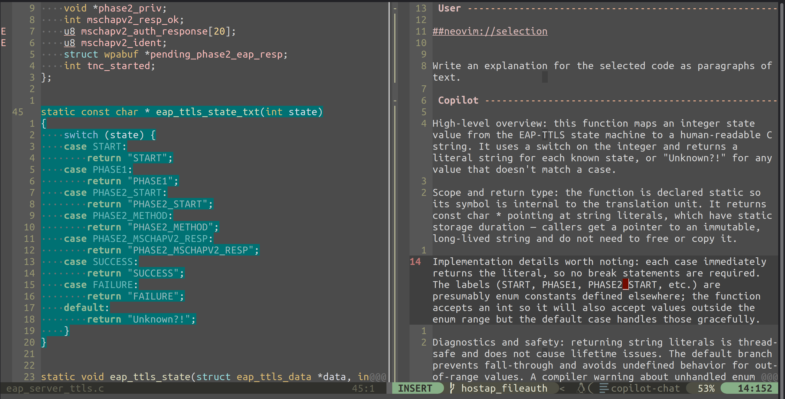
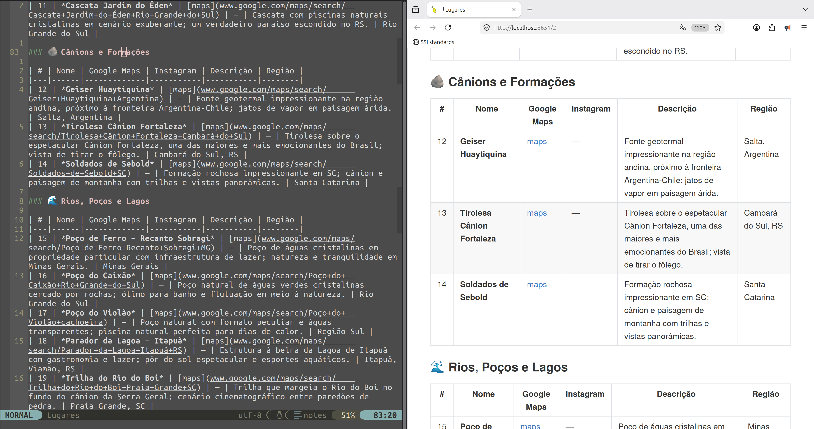

# Neovim configuration

Neovim configuration with GitHub Copilot, LSP, fuzzy finder, notes and markdown preview.




## Prerequisites

| Requirements |
|-------------|
| Neovim 0.11+ |
| Git |
| Node.js ≥ 18 + npm |
| Nerd Font |
| GitHub Copilot subscription |
| C compiler (gcc) |

LSP servers are installed automatically by Mason — no manual install needed.

## Install

```bash
cp ~/Downloads/init.lua.ai ~/.config/nvim/init.lua
rm -f ~/.config/nvim/init.vim
nvim +":Lazy sync"
nvim +":Copilot auth"       # authenticate in browser
nvim +":Mason"              # press i on each LSP server
nvim +":TSInstall all"      # install tree-sitter parsers
```

## Keymaps

### AI — Copilot

| Key | Mode | Action |
|-----|------|--------|
| `<C-l>` | Insert | Accept ghost suggestion |
| `<C-k>` | Insert | Accept one word |
| `<C-j>` | Insert | Accept one line |
| `<C-]>` | Insert | Dismiss suggestion |
| `<leader>cc` | Normal / Visual | Open chat |
| `<leader>ce` | Visual | Explain selection |
| `<leader>ct` | Visual | Generate tests |
| `<leader>cr` | Visual | Review code |
| `<leader>cR` | Visual | Refactor |
| `<leader>cT` | Normal | Toggle chat window |
| `<leader>cC` | Normal | Reset chat context |

### Editor

| Key | Action |
|-----|--------|
| `<F4>` | Markdown → browser with live reload |
| `<F5>` | Recent Notes |
| `<F6>` | File explorer |
| `<F7>` | Undo tree |
| `<F10>` | Markdown inline preview |
| `<C-p>` | Find files |
| `<C-g>` | Search text in project |
| `<C-b>` | Open buffers |
| `<leader>q` | Close buffer |
| `<leader><space>` | Clear search highlight |
| `gd` | Go to definition |
| `gr` | References |
| `gi` | Implementations |
| `K` | Hover documentation |
| `<leader>rn` | Rename symbol |
| `<leader>ca` | Code action |
| `<leader>cf` | Format file |
| `gc` | Toggle comment |
| `]c` / `[c` | Next / previous git hunk |
| `<leader>hs` | Stage hunk |
| `<leader>hr` | Reset hunk |
| `<leader>hp` | Preview hunk |
| `<leader>hb` | Blame line |

### Commands

| Command | Action |
|---------|--------|
| `:Copilot auth` | Authenticate |
| `:Copilot status` | Connection status |
| `:CopilotChat` | Open chat |
| `:CopilotChatExplain` | Explain selection |
| `:CopilotChatTests` | Generate tests |
| `:CopilotChatReview` | Review code |
| `:CopilotChatRefactor` | Refactor |
| `:CopilotChatReset` | Clear chat history |
| `:Mason` | Manage LSP servers |
| `:Lazy` | Manage plugins |
| `:Lazy sync` | Install plugins |
| `:TSInstall <lang>` | Install tree-sitter parser |
| `:checkhealth` | Diagnostics |
| `:Markview toggle` | Toggle inline markdown preview |

## Plugins

| Category | Plugin |
|----------|--------|
| AI | `copilot.lua` + `copilot-cmp` + `CopilotChat.nvim` |
| Markdown | `markview.nvim` (inline) + `markdown-preview.nvim` (browser) |
| LSP | `mason.nvim` + `mason-lspconfig` + `nvim-lspconfig` |
| Completion | `nvim-cmp` + `LuaSnip` |
| Fuzzy finder | `telescope.nvim` |
| Syntax | `nvim-treesitter` |
| Git | `vim-fugitive` + `gitsigns.nvim` |
| File tree | `nvim-tree.lua` |
| Theme | `tokyonight.nvim` |
| Statusline | `lualine.nvim` |
| Indent guides | `indent-blankline.nvim` |
| Undo | `undotree` |
| Editing | `vim-surround` + `vim-commentary` + `nvim-autopairs` + `auto-pairs` + `vim-easy-align` |
| LaTeX | `vimtex` |
| Notes | `xolox/vim-notes` |
| Util | `which-key.nvim` + `vim-highlightedyank` |
